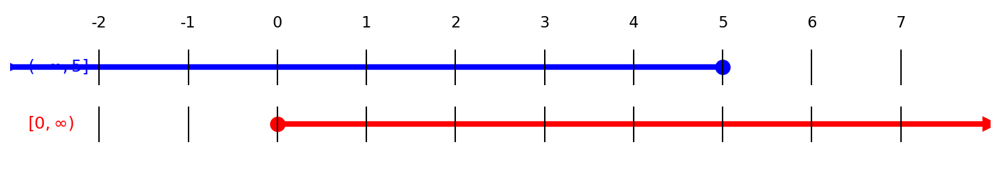
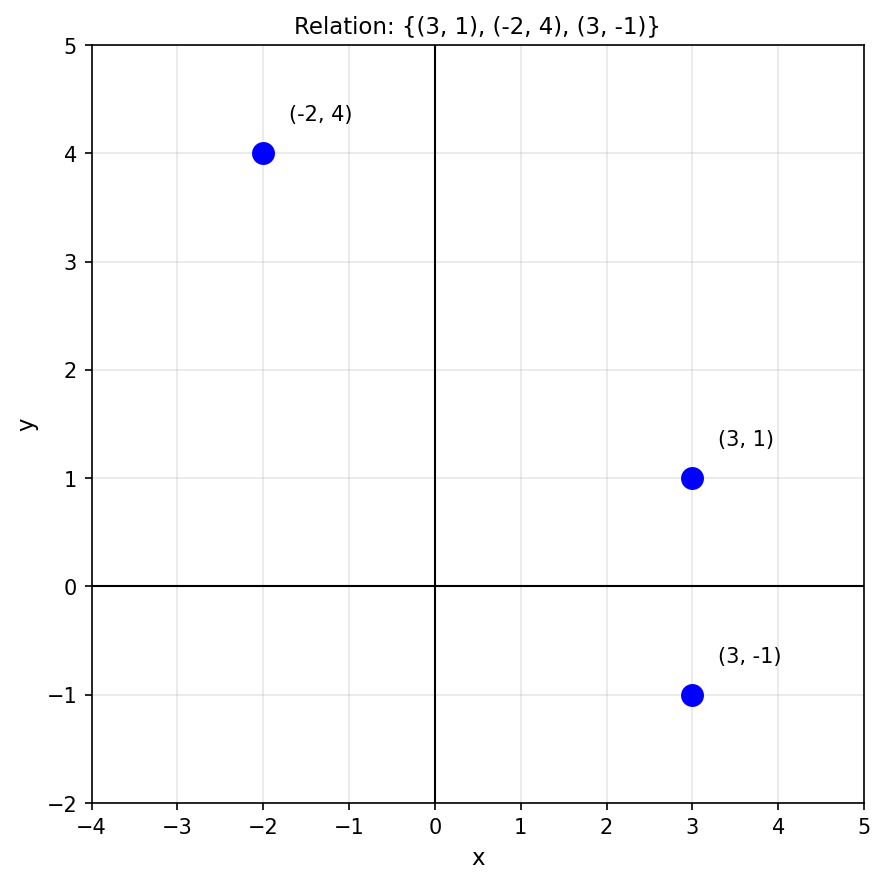
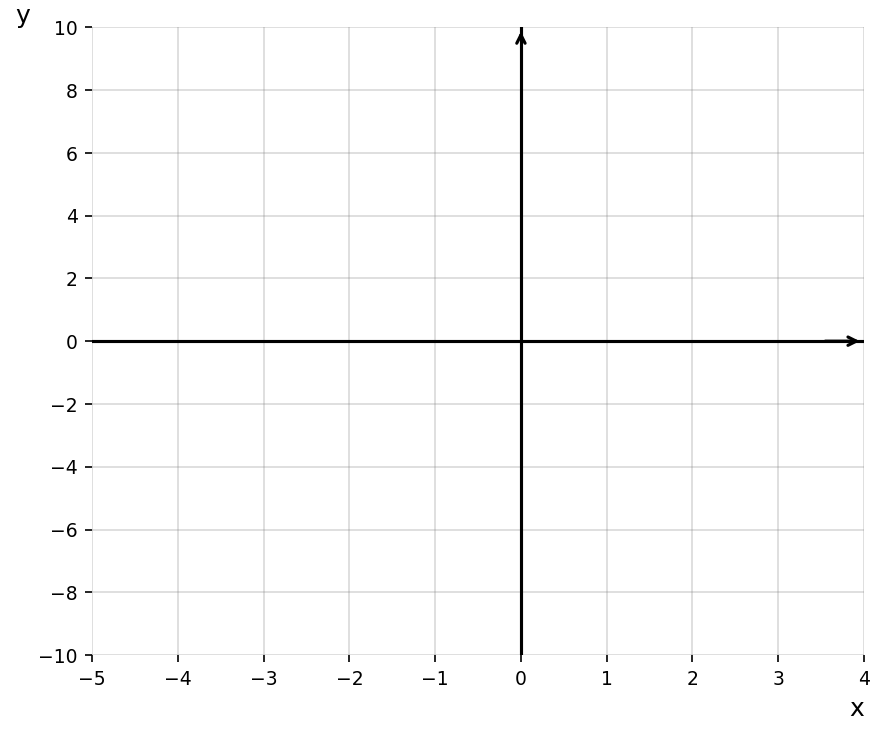
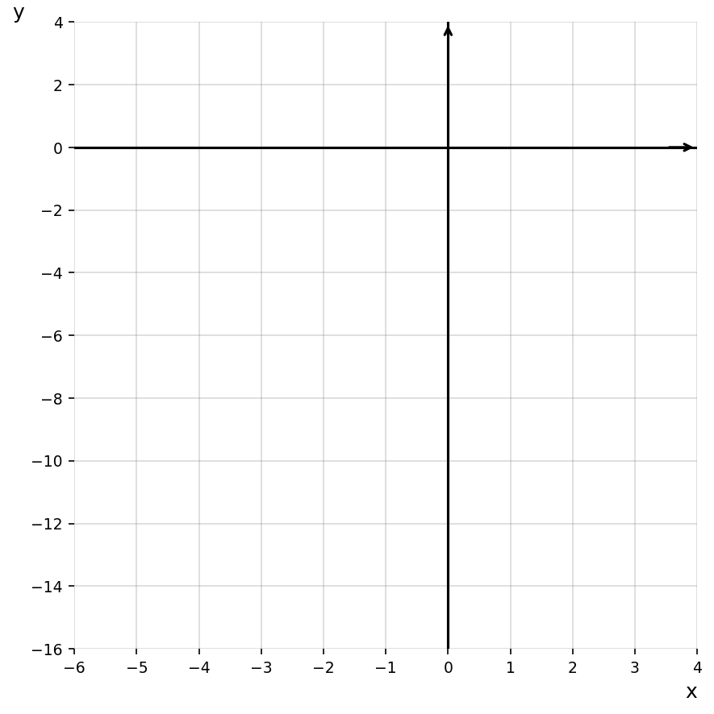
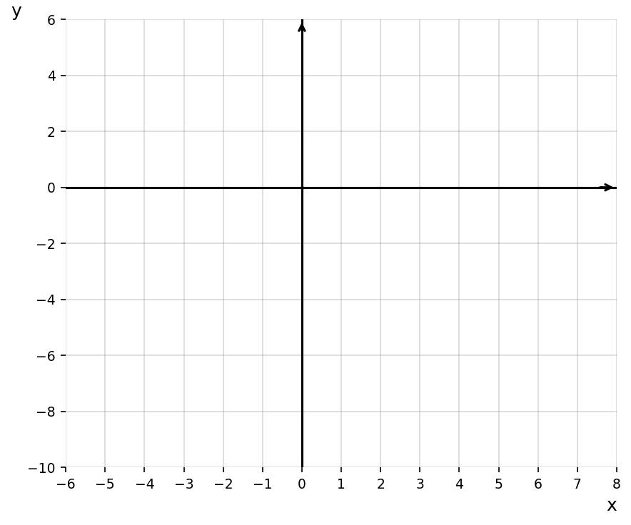
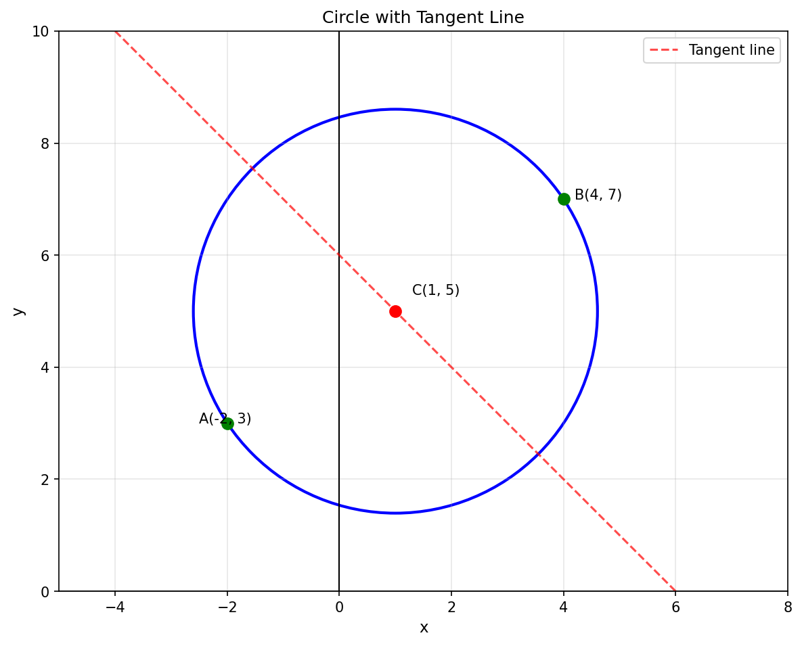
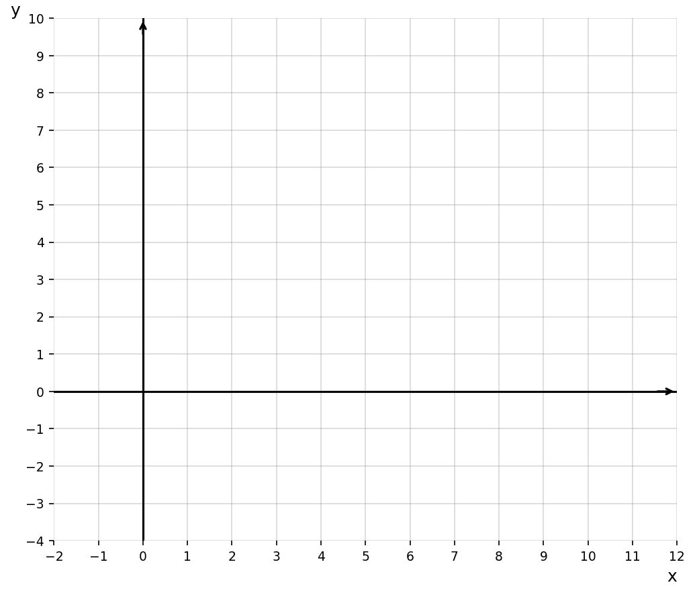

# Year 10 Mathematics AOS 9 Revision [10.4] Mock CAT 1 - Version B

**Instructions:** Answer all questions. Show all working.
**Total Marks:** 50
**Time:** 60 minutes

---

## Section A: Short Answer Questions (36 Marks)

---

### Question 1 [1 mark]

Write the intersection $(-\infty, 5] \cap [0, \infty)$ in interval notation.

---

### Question 2 [1 mark]

Factorise completely: $16x^2 - 49$.

---

### Question 3 [1 mark]

Does the relation $\{(3, 1), (-2, 4), (3, -1)\}$ define a function? Give a reason.

---

### Question 4 [1 mark]

Expand: $(x - 2)(x + 7)$.

---

### Question 5 [1 mark]

For $y = (x + 2)^2 - 5$, find the y-intercept.

---

### Question 6 [2 marks]

Use long division to find the quotient and remainder when $3x^4 + 2x^3 - 4x + 1$ is divided by $x^2 - 1$.

---

### Question 7 [2 marks]

Solve $x^3 + 2x^2 - 4x - 8 = 0$.

---

### Question 8 [2 marks]

Sketch $y = (x + 2)^2(x - 2)$. Label all intercepts.

---

### Question 9 [2 marks]

Find the centre and radius of $x^2 + y^2 - 6x + 8y - 11 = 0$.

---

### Question 10 [2 marks]

Let $f(x) = 2x^3 + 5x^2 + x - 2$. Using the Remainder Theorem, find the remainder on division by $x + 1$. Hence, decide if $x + 1$ is a factor.

---

### Question 11 [2 marks]

Sketch $y = (x - 1)^4 - 2$. Label the turning point and any intercepts.

---

### Question 12 [2 marks]

Find $k$ so that $(x - 2)$ is a factor of $x^3 - kx^2 + x + 6$. Hence, factor the polynomial completely.

---

### Question 13 [2 marks]

Sketch the graph $y = \frac{-3}{x+2} + 1$. Label the asymptotes.

---

### Question 14 [4 marks]

From the platform edge at $x = -2$ m to $x = 7$ m along the deck, the slide height (m) is $h(x) = \sqrt{x + 2} - 3$.

**a.** State the domain and range over this section. **(2 marks)**

**b.** How far from the edge ($x = -2$) does the slide first reach $-1$ m high? **(2 marks)**

---

### Question 15 [4 marks]

A circular spray pattern is $(x + 3)^2 + (y - 2)^2 = 25$ (metres).

**a.** State the centre and radius. **(1 mark)**

**b.** Is $(1, 5)$ on the boundary? Justify. **(1 mark)**

**c.** The sprinkler is moved 4 m right and 1 m down. Write the new equation. **(2 marks)**

---

### Question 16 [3 marks]

A stage light intensity curve is $y = -\frac{1}{2}(x - 3)^4 + 2$.

**a.** Describe the transformations from $y = x^4$. **(2 marks)**

**b.** Identify the turning point and whether the curve opens up or down; justify from your description. **(1 mark)**

---

### Question 17 [4 marks]

A tunnel cross-section is $x^2 + y^2 = 25$ (metres), ground is $y = 0$. A truck travels along the centreline.

**a.** Determine the maximum truck width that fits at the height $y = 4$ m. **(2 marks)**

**b.** If the truck is 6 m wide, what is the maximum height it can have at the centreline? Give an exact value. **(2 marks)**

---

## Section B: Extended Response Questions (14 Marks)

---

### Question 18 [14 marks]

The city is finalising Harmony Plaza, a plaza drawn on the Cartesian plane (units in metres).

The outer rim of a round seating area is a circle whose diameter has endpoints $A(-2, 3)$ and $B(4, 7)$.

**a.** Find the equation of the circle. **(3 marks)**

A family of straight paths is planned with equations $L_k: y = -x + k$.

**b.** Determine the value(s) of $k$ for which $L_k$ is tangent to the circle. **(3 marks)**

**c.** Hence, determine the equation of the tangent line(s). **(1 mark)**

**d.** **Tech-Active.** Sketch the graph of the circle and a line $L_k$ for the $k$ found in **part b**. Label the point of intersection, correct to two decimal places. **(3 marks)**

A raised planter's front edge is modelled by the cubic:
$$G(x) = x^3 - 5x^2 + 2x + 8$$

**e.**

**i.** Use the Factor Theorem to show that $(x - 2)$ is a factor of $G(x)$. **(1 mark)**

**ii.** Perform polynomial division to factorise $G(x)$ completely, and use the Null Factor Law to find all x-intercepts. **(3 marks)**

---

**End of Test**
